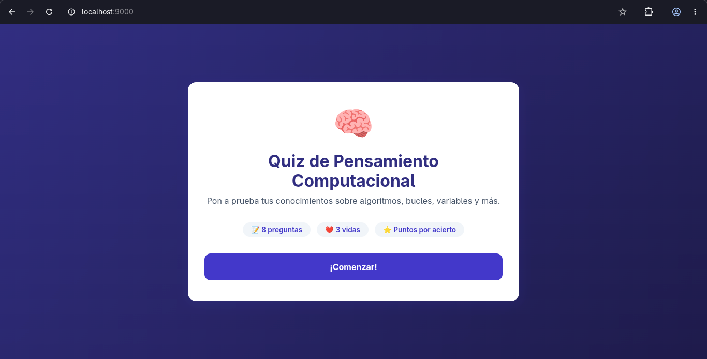
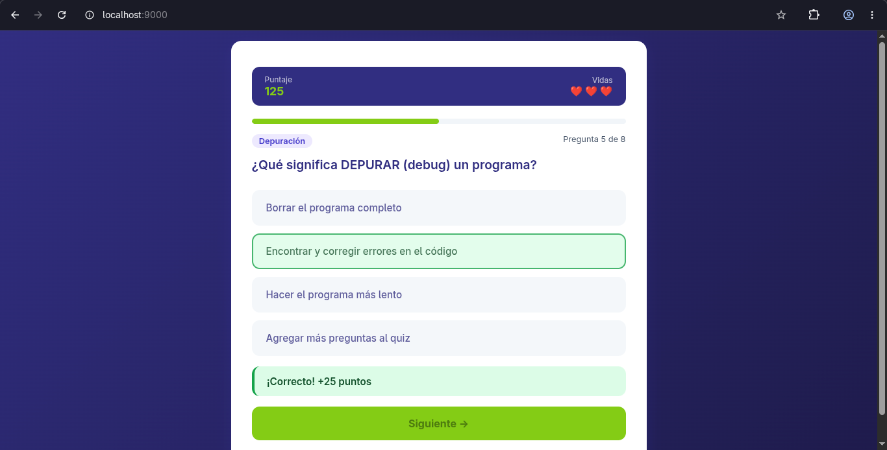
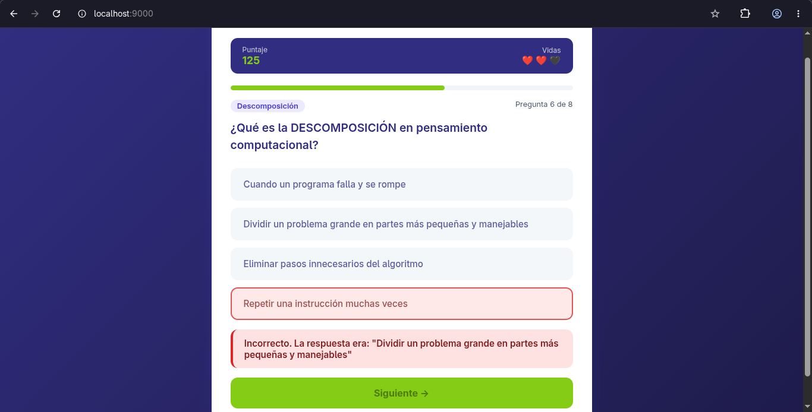
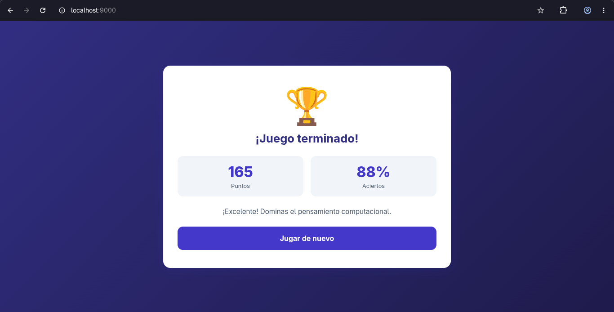

# Quiz de Pensamiento Computacional

Proyecto final del curso **Fundamentos de Programación** — 3er/4to semestre.

Un juego de preguntas interactivo (quiz) con gamificación para enseñar
Pensamiento Computacional a estudiantes de colegio.

---

## ¿De qué trata?

El jugador responde 8 preguntas sobre conceptos de pensamiento computacional
(algoritmos, bucles, variables, condicionales, funciones, etc.).
Cada respuesta correcta suma puntos, y el jugador tiene 3 vidas.
Al terminar se muestra un resumen con puntaje, porcentaje de aciertos y una medalla.

---

## Tecnologías usadas

- **HTML5** — estructura de las pantallas
- **CSS3** — diseño visual y animaciones
- **JavaScript ES6** — lógica del juego con Programación Orientada a Objetos

---

## Estructura del proyecto

```
quiz-pensamiento/
├── index.html          ← punto de entrada, estructura HTML
├── README.md           ← este archivo
├── css/
│   └── estilos.css     ← estilos visuales
└── js/
    ├── Pregunta.js     ← clase Pregunta (modelo de datos)
    ├── Juego.js        ← clase Juego (lógica y estado)
    ├── UI.js           ← clase UI (manipulación del DOM)
    ├── preguntas.js    ← arreglo con las 8 preguntas
    └── main.js         ← punto de entrada, eventos y flujo principal
```

---

## Clases POO

### Clase Pregunta
Representa una pregunta del quiz.

- Atributos: texto, opciones[], respuestaCorrecta, categoria
- Métodos: esCorrecta(indice), getRespuestaTexto()

### Clase Juego
Controla el estado completo del juego.

- Atributos: puntaje, vidas, indiceActual, estado
- Métodos: responder(indice), reiniciar(), getPorcentaje(), estaActivo()

### Clase UI
Actualiza lo que el usuario ve en pantalla.

- Métodos: mostrarPantalla(), mostrarPregunta(), actualizarHUD(), mostrarFeedback(), mostrarResultados()

---

## Pseudocódigo general

```
INICIO
  Crear arreglo de Preguntas
  Crear objeto Juego con esas preguntas
  Crear objeto UI

  Mostrar pantalla de bienvenida

  CUANDO el usuario hace clic en "Comenzar":
    Juego.reiniciar()
    Mostrar primera pregunta

  MIENTRAS Juego.estaActivo():
    Mostrar pregunta actual con sus opciones

    CUANDO el usuario elige una opción:
      resultado = Juego.responder(indiceElegido)

      SI resultado.correcto:
        Sumar puntos al puntaje
        Mostrar feedback verde
      SINO:
        Restar una vida
        Mostrar feedback rojo

      Actualizar HUD con puntaje y vidas

      SI Juego.vidas == 0:
        estado = "perdido"
      SI no quedan más preguntas:
        estado = "ganado"

  Mostrar pantalla final con puntaje, porcentaje y medalla
FIN
```

---

## Elementos del lenguaje utilizados

| Elemento            | Ejemplo en el proyecto                              |
|---------------------|-----------------------------------------------------|
| Variables           | puntaje, vidas, indiceActual                        |
| Tipos de datos      | string, number, boolean, array, object              |
| Condicionales       | if/else para verificar respuestas y estado          |
| Bucles              | forEach para recorrer preguntas y opciones          |
| Funciones           | Métodos de cada clase y funciones en main.js        |
| Clases POO          | Pregunta, Juego, UI                                 |
| Eventos DOM         | addEventListener para clics del usuario             |
| Funciones biblioteca| Math.random(), Array.sort(), setTimeout()           |

---

## Cómo ejecutar

Opción 1 — servidor Python:

```bash
cd quiz-pensamiento
python3 -m http.server 9000
```

Luego abrir en el navegador: http://localhost:9000

Opción 2 — abrir directo en el navegador:

```bash
xdg-open index.html
```

---

## Pruebas de funcionamiento

Se realizaron las siguientes pruebas manualmente ejecutando el proyecto en el navegador:

| Caso de prueba | Acción | Resultado esperado | Resultado obtenido |
|---|---|---|---|
| Inicio del juego | Clic en "Comenzar" | Aparece la primera pregunta | Correcto |
| Respuesta correcta | Seleccionar opción correcta | Feedback verde, suma puntos | Correcto |
| Respuesta incorrecta | Seleccionar opción incorrecta | Feedback rojo, resta una vida | Correcto |
| Sin vidas | Fallar 3 preguntas seguidas | Pantalla final con estado "perdido" | Correcto |
| Completar quiz | Responder las 8 preguntas | Pantalla final con puntaje y medalla | Correcto |
| Reiniciar | Clic en "Jugar de nuevo" | Vuelve al inicio con puntaje en 0 | Correcto |
| Preguntas aleatorias | Reiniciar el juego | Las preguntas salen en orden distinto | Correcto |

---

### 1. Pantalla de inicio


### 2. Pregunta con respuesta correcta


### 3. Pregunta con respuesta incorrecta


### 4. Pantalla final


---

## Análisis de recursos computacionales

El proyecto es liviano por diseño, pensado para correr en computadoras de colegio con recursos limitados.

**Memoria:** se crean 3 objetos principales en memoria (Pregunta x8, Juego x1, UI x1).
El arreglo de 8 preguntas ocupa menos de 5 KB en memoria RAM.
No se usan librerías externas, por lo que no hay dependencias adicionales que consuman recursos.

**Tiempo de carga:** al no tener imágenes, fuentes externas ni librerías, el tiempo de carga
es menor a 100ms en cualquier computadora con navegador moderno.

**Procesamiento:** cada interacción del usuario (clic en opción) ejecuta como máximo 5 funciones
encadenadas. No hay operaciones costosas ni ciclos infinitos. El método `Array.sort()`
con `Math.random()` para mezclar preguntas es O(n log n) con n=8, lo cual es instantáneo.

**Conclusión de recursos:** el proyecto es eficiente y puede ejecutarse sin problemas
en equipos con hardware básico, sin conexión a internet y sin instalar nada adicional.

---

## Mejoras respecto al prototipo inicial

El prototipo inicial (versión 1) era una página HTML simple con las preguntas escritas
directamente en el HTML, sin lógica separada ni POO:

- Las preguntas estaban hardcodeadas en el HTML como listas
- No había puntaje ni vidas
- No existía feedback visual al responder
- El código mezclaba HTML, CSS y JS en un solo archivo
- No había pantalla de inicio ni pantalla final

La versión actual (versión 2, entrega final) incorpora las siguientes mejoras:

- Arquitectura POO con 3 clases separadas (Pregunta, Juego, UI)
- Sistema de puntaje con bonus por vidas restantes
- Sistema de 3 vidas con pérdida progresiva
- Feedback visual inmediato (verde/rojo) tras cada respuesta
- Barra de progreso animada
- Pantalla de bienvenida, pantalla de juego y pantalla final
- Preguntas mezcladas aleatoriamente en cada partida
- Código separado en archivos por responsabilidad
- Comentarios explicativos en todas las funciones y clases

---

## Conclusiones

Este proyecto permitió aplicar en la práctica los fundamentos del lenguaje de programación
JavaScript bajo el paradigma de Programación Orientada a Objetos.

Se comprendió la importancia de separar responsabilidades en distintas clases: la clase
Pregunta modela los datos, la clase Juego maneja la lógica, y la clase UI se encarga
de lo visual. Esta separación hace el código más fácil de leer, mantener y escalar.

El uso de estructuras de control (if/else, forEach), tipos de datos (string, number,
boolean, array, object), funciones de biblioteca (Math.random, setTimeout, addEventListener)
y declaraciones de variables (let, const) demostró cómo los elementos básicos del lenguaje
se combinan para construir una aplicación real y funcional.

La gamificación resultó ser una estrategia efectiva para enseñar pensamiento computacional:
al envolver los conceptos en un juego con puntos, vidas y medallas, el estudiante de
colegio tiene una motivación concreta para aprender y repetir la experiencia.

---

## Autor

Proyecto desarrollado para el curso Fundamentos de Programación.